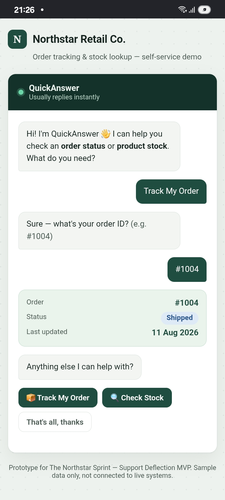
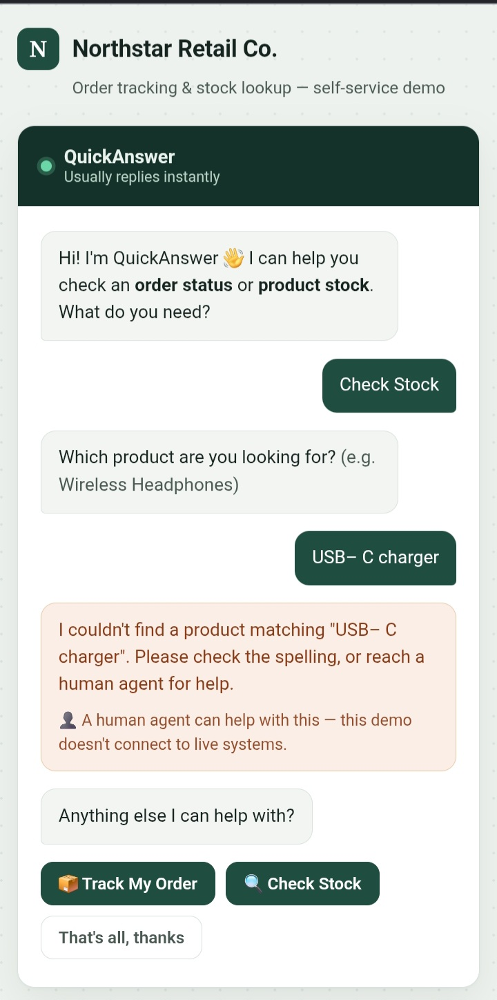
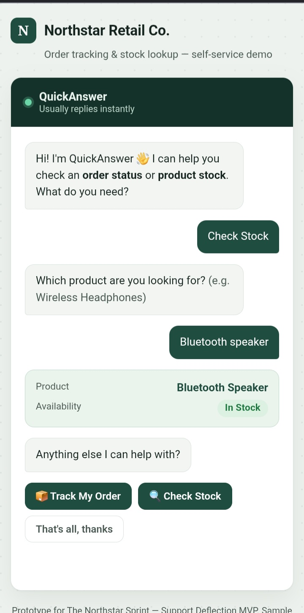

# QA Test Plan — QuickAnswer

Tester: Loureen Shillah (QA & Testing Lead). Fill in **Actual Result** and **Pass/Fail** columns once tests are run against the real build.

| Test ID | Scenario | Input | Expected Result | Actual Result | Pass/Fail | Tester |
|---|---|---|---|---|---|---|
| TC01 | Valid order ID lookup | `#1004` | Returns "Shipped" with date 2026-08-11 | | | |
| TC02 | Invalid/unknown order ID | `#9999` | Shows fallback/escalation message | | | |
| TC03 | Order ID with different casing | `#1004` typed as lowercase or with extra space | Still matches and returns correct status | | | |
| TC04 | Empty order ID submitted | (blank) | Prompts "Please enter a value", no lookup attempted | | | |
| TC05 | Valid product name lookup (exact) | `Wireless Headphones` | Returns "Low Stock" with restock date 2026-08-20 | | | |
| TC06 | Valid product name lookup (partial match) | `headphones` | Returns same result as TC05 | | | |
| TC07 | Out-of-stock product | `USB-C Charging Cable` | Returns "Out of Stock" with restock date 2026-08-18 | | | |
| TC08 | In-stock product (qty > 5) | `Bluetooth Speaker` | Returns "In Stock", no restock date shown | | | |
| TC09 | Invalid/unknown product name | `Drone` | Shows fallback/escalation message | | | |
| TC10 | Empty product name submitted | (blank) | Prompts "Please enter a value", no lookup attempted | | | |
| TC11 | "Anything else?" loop after order result | Click "Anything else?" after TC01 | Returns to greeting/category selection screen | | | |
| TC12 | Switch category mid-flow | Click "Check Stock" while Order input is showing | Cleanly switches to Stock input panel, no leftover state | | | |

## Bug Log
(QA Lead fills this in during T12 for anything that fails)

| Bug ID | Related Test ID | Description | Severity | Reported To | Status |
|---|---|---|---|---|---|
| | | | | Technical Lead | |

## Test Summary (fill in after T12)
- Total test cases: 12
- Passed: [fill in]
- Failed: [fill in]
- Bugs found and fixed before demo: [fill in]
- Known unresolved issues (if any, disclose honestly in the Go-Live Readiness Note): [fill in]

## QA Evidence

### Order-status success — PASS
Tested with order `#1004`. The system returned the expected **Shipped** status.

### Order-status fallback — PASS
Tested with an invalid order `#9999`. The system returned the fallback response and provided an option to escalate to a human agent.

### Stock-availability success — PASS
Tested by searching for `Speaker`. The system returned the **Bluetooth Speaker — In Stock** result.

